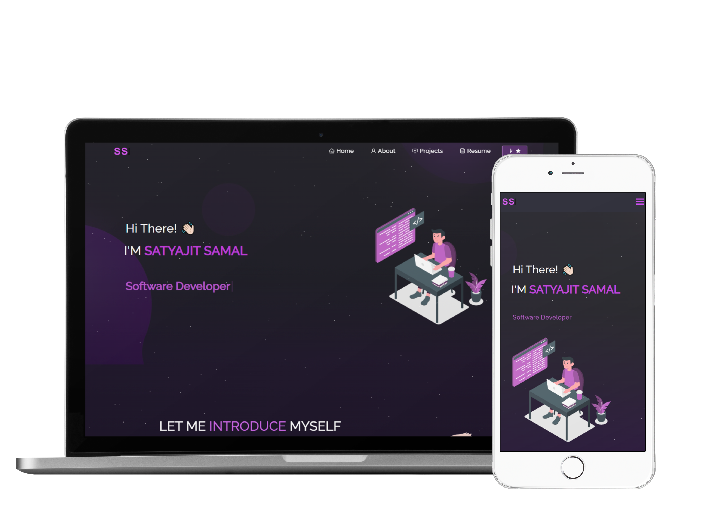
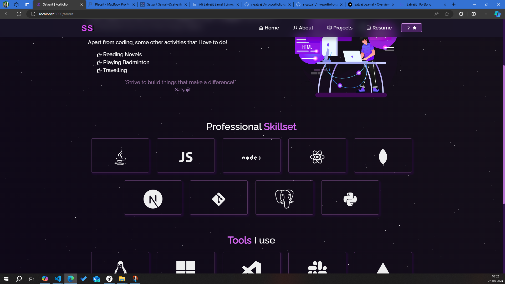

# My Portfolio - Satyajit Samal

<div align="center">
    
</div>

<div align="center">
    
</div>
<br>
Welcome to my personal portfolio website repository! This project showcases my resume, projects, education, and professional details.

## Table of Contents

- About
- Features
- Technologies Used
- Installation
- Usage
- Projects
- Contact

## About

This portfolio website is designed to provide a comprehensive overview of my professional background, skills, and accomplishments. It includes sections for my resume, projects, education, and other relevant details.

## Features

- Responsive design
- Interactive project showcase
- Downloadable resume
- Contact form

## Technologies Used

- HTML
- CSS
- JavaScript
- ReactJS
- Context API

## Installation

To run this project locally, follow these steps:

1. Clone the repository:
   ```bash
   git clone https://github.com/satyajitsamal/my-portfolio-satyajitsamal.git
   ```

2. Navigate to the project directory:
    ```bash
    cd my-portfolio-satyajitsamal
    ```

3. Install the dependencies:
    ```bash
    npm install
    ```

4. Start the development server:
    ```bash
    npm start
    ```

## Usage
Open your browser and navigate to ```https://localhost:3000``` to view the portfolio website.